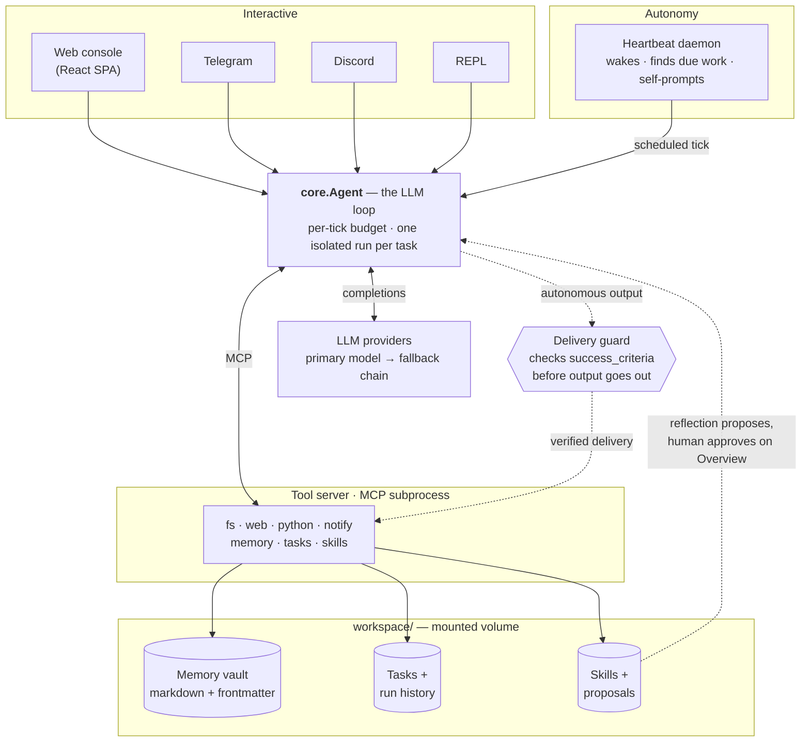

<p align="center">
  
</p>

<p align="center"><b>A minimal autonomous personal assistant — built from scratch, no agent frameworks.</b></p>


&nbsp;
&nbsp;

One small Python package wraps a tool-calling LLM in the pieces that make it
useful unattended: durable memory, scheduled tasks, a background autonomy loop,
self-authored skills, and chat over the web, Telegram, and Discord. It runs on
a small, cheap open-weight model (`deepseek/deepseek-v4-flash-0731` via
OpenRouter, swappable in `.env`) on a deliberately tight budget.

<div align="center">
<table>
<tr>
<td width="50%"><br><sub><b>Overview</b> — live status: next-heartbeat countdown, activity &amp; failures</sub></td>
<td width="50%"><br><sub><b>Tasks</b> — scheduled &amp; recurring autonomous work</sub></td>
</tr>
<tr>
<td width="50%"><br><sub><b>Traces</b> — every tool call and result, auditable</sub></td>
<td width="50%"><br><sub><b>Tools</b> — MCP tool usage and run controls</sub></td>
</tr>
</table>
</div>

## The problem

Homunculus runs a cheap, open-weight model unattended on a tight budget. The
hard part is *unattended*: no one reads any individual run, so a plausible
wrong answer ships as readily as a right one, and a task that quietly stopped
working looks exactly like one that never had anything to report. That is true
of a frontier model too — it is a property of running without a reader, not of
model size. So reliability is treated as a property of the harness, not the
model:

- **Tool calls pass a gate before they run** — a policy can refuse a call (the
  reason goes back to the model, so it adapts instead of failing blindly) or
  repair a malformed argument in place, which costs nothing where a rejection
  would have cost a round trip.
- **Deliveries are verified against tool output** — a result with no work behind
  it, or a fabricated link, is refused rather than sent.
- **Self-improvement is human-gated** — the agent proposes skill changes from its
  own execution traces; none take effect until approved.
- **Infrastructure failures are kept separate from genuine ones** — transient
  outages are retried and alerted, while only real failures feed the reflection
  loop, so the agent doesn't try to fix problems that aren't its own.

Every tool call, cost, and guard decision is recorded, so the system is auditable
end to end — including against itself. Two weeks of production traces (9,375
events) show which guards actually earn their keep: the delivery verifier
blocked nothing across 59 replies, while the loop guards fired 383 times (236
stuck-loop, 147 duplicate-call), 211 of them a single skill re-proposing an
identical edit.

That zero is narrower than it looks, and the difference matters. The delivery
verifier checks a reply's claims against the run's tool outcomes; it does not
inspect the *arguments* the model sent. A weekly run called
`github_profile(user="system")` — a real GitHub account — and reported that
stranger's follower count as the operator's. Every check passed, because the
numbers were genuinely fetched and the criteria found what they looked for.
Only the identity was invented, one call in eleven.

So: no fabricated *claims* in two weeks, one fabricated *identifier*. The
lesson is not that a guard failed but that each guard covers exactly what it
inspects — which is why identity arguments are now pinned by the permission
gate on unattended runs, and why the harness owns delivery verdicts,
success criteria, and failure evidence rather than accepting the model'"'"'s word
for any of them.

## What it does

- **Talks to you** over a web console, Telegram, or Discord — same agent,
  shared memory, one conversation across channels.
- **Remembers** across sessions in a plain-markdown vault (open it in Obsidian),
  with optional semantic recall.
- **Runs scheduled work on its own** via a heartbeat daemon — daily briefs, a
  weekly GitHub health check, a spaced-repetition quiz coach, RSS digests.
- **Drafts job applications from your own career context** — paste a posting
  link and it fills the form's free-text answers grounded in a wiki you
  control, leaves legal/EEO questions to you by design, and never submits;
  a visible local browser does the mechanical fill for your review.
- **Extends itself** by proposing new skills and repairing broken ones — every
  change is filed for your approval, never applied silently.
- **Stays cheap and honest** — a multi-provider fallback chain, a per-tick
  iteration budget, and output guards that stop it claiming work it didn't do.

## Architecture



Read it top-down: any transport (or the heartbeat) drives **one** provider-
agnostic agent loop; the loop talks to its tools over MCP in a **separate
process**, and every autonomous delivery passes a guard that verifies it
against what the tools actually did. All durable state lives in a mounted
`workspace/` volume, and skill changes only ever reach the registry through a
human-approved proposal. Everything is one importable package, `homunculus/`.

## Quickstart

Requires Docker and an [OpenRouter](https://openrouter.ai/keys) API key.

```bash
cp .env.example .env          # then set HOMUNCULUS_API_KEY
docker compose up -d web      # web console at http://localhost:8765
docker compose up -d heartbeat   # the autonomy daemon (optional)
```

Other entry points (all share the same image and workspace):

```bash
docker compose run --rm homunculus              # interactive REPL
docker compose up -d telegram                   # Telegram bridge
docker compose --profile discord up -d discord  # Discord bridge
```

See [`.env.example`](.env.example) for the full configuration surface —
fallback providers, web search (Tavily), semantic recall (Google AI Studio),
the chat bridges, and the heartbeat interval.

## Project layout

```
homunculus/            # the application package
  core.py              # the Agent class + the tool-calling loop (the heart)
  llm.py               # LLM client: provider fallback chain, budget gate, cooldown
  memory.py            # markdown-frontmatter memory vault (+ archival, transcript)
  tasks.py             # structured tasks with per-run history
  locking.py           # the one cross-process file_lock() every store uses
  heartbeat.py         # autonomy daemon: wakes, finds due work, self-prompts
  skills.py            # learned procedures the agent can author and refine
  tools/               # tool registry + implementations, exposed over MCP
  transports/          # repl, telegram, discord, web_api + per-domain web routers
scripts/               # one-off operational scripts (bootstraps, migrations)
tests/                 # pytest suite
web/                   # React + Vite single-page app for the web console
workspace/             # mounted volume: memory vault, sessions, event log
```

Services run as modules: `python -m homunculus.transports.repl`,
`python -m homunculus.heartbeat`, `uvicorn homunculus.transports.web_api:app`.

## Development

Uses [`uv`](https://docs.astral.sh/uv/) for dependency management.

```bash
uv run ruff check homunculus   # lint
uv run pyright homunculus      # static type check (basic, kept at zero errors)
uv run python -m pytest        # test suite (under a 60% coverage floor)
```

CI runs all three on every push and PR. Tests run locally without Docker —
`tests/conftest.py` stubs the container-only dependencies (MCP) so the pure
logic is testable in isolation.

## Documentation

- **[`ARCHITECTURE.md`](ARCHITECTURE.md)** — how the system is put together: the
  runtime topology, package map, the agent loop, and the reliability harness.
  Start here to understand the code.
- **[`AGENTS.md`](AGENTS.md)** — the agent's identity layer (persona, rules,
  tool catalogue), loaded into the system prompt on every turn. Edit freely.
- **`PLAN.md`, `IDEAS.md`** — the working backlog and consciously-deferred ideas.
- **`docs/`** — dated design notes and roadmaps. These are point-in-time
  records of how the project was reasoned through; they are historical, not
  current specification.
