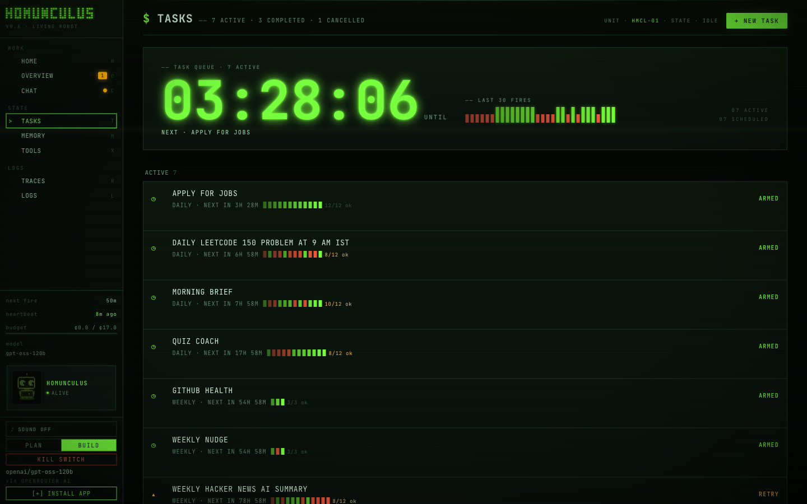
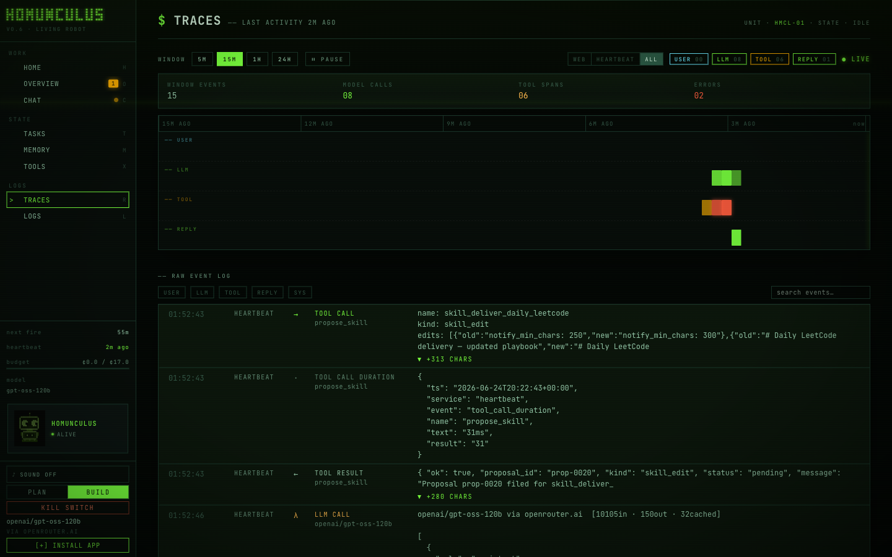
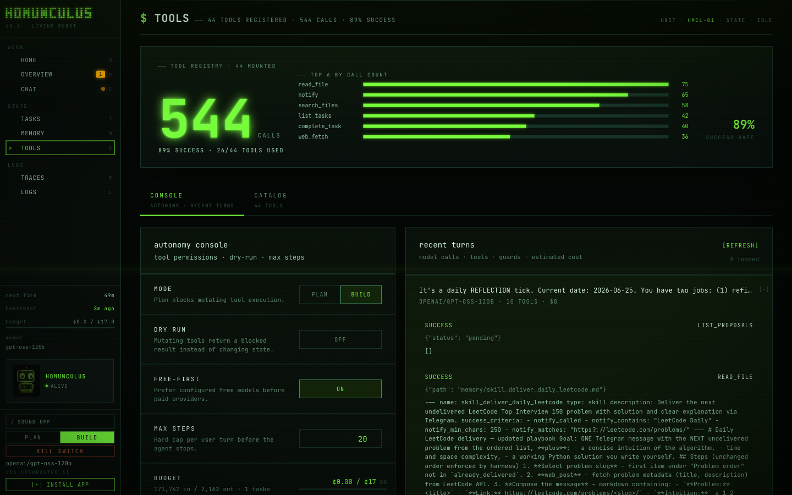
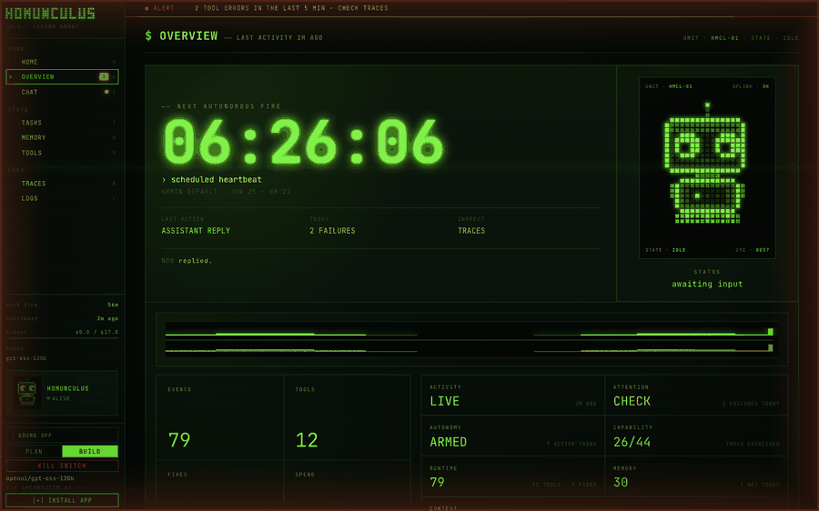

<p align="center">
  
</p>

<p align="center"><b>A minimal autonomous personal assistant — built from scratch, no agent frameworks.</b></p>


&nbsp;
&nbsp;

One small Python package wraps a tool-calling LLM in the pieces that make it
useful unattended: durable memory, scheduled tasks, a background autonomy loop,
self-authored skills, and chat over the web, Telegram, and Discord. It runs on
an open-weight model (`openai/gpt-oss-120b` via OpenRouter) on a deliberately
tight budget.

<div align="center">
<table>
<tr>
<td width="50%"><br><sub><b>Overview</b> — live status: next-heartbeat countdown, activity &amp; failures</sub></td>
<td width="50%"><br><sub><b>Tasks</b> — scheduled &amp; recurring autonomous work</sub></td>
</tr>
<tr>
<td width="50%"><br><sub><b>Traces</b> — every tool call and result, auditable</sub></td>
<td width="50%"><br><sub><b>Tools</b> — MCP tool usage and run controls</sub></td>
</tr>
</table>
</div>

<p align="center">
  
  <br><sub><b>Autonomous mode</b> — while the heartbeat acts on its own, the viewport breathes a red frame. It's honest by construction: it can only appear during real autonomous activity.</sub>
</p>

## What it does

- **Talks to you** over a web console, Telegram, or Discord — same agent,
  shared memory, one conversation across channels.
- **Remembers** across sessions in a plain-markdown vault (open it in Obsidian),
  with optional semantic recall.
- **Runs scheduled work on its own** via a heartbeat daemon — daily briefs, a
  weekly GitHub health check, a spaced-repetition quiz coach, RSS digests.
- **Extends itself** by proposing new skills and repairing broken ones — every
  change is filed for your approval, never applied silently.
- **Stays cheap and honest** — a multi-provider fallback chain, a per-tick
  iteration budget, and output guards that stop it claiming work it didn't do.

## Architecture


Read it top-down: any transport (or the heartbeat) drives **one** provider-
agnostic agent loop; the loop talks to its tools over MCP in a **separate
process**, and every autonomous delivery passes a guard that verifies it
against what the tools actually did. All durable state lives in a mounted
`workspace/` volume, and skill changes only ever reach the registry through a
human-approved proposal. Everything is one importable package, `homunculus/`.

## Quickstart

Requires Docker and an [OpenRouter](https://openrouter.ai/keys) API key.

```bash
cp .env.example .env          # then set HOMUNCULUS_API_KEY
docker compose up -d web      # web console at http://localhost:8765
docker compose up -d heartbeat   # the autonomy daemon (optional)
```

Other entry points (all share the same image and workspace):

```bash
docker compose run --rm homunculus              # interactive REPL
docker compose up -d telegram                   # Telegram bridge
docker compose --profile discord up -d discord  # Discord bridge
```

See [`.env.example`](.env.example) for the full configuration surface —
fallback providers, web search (Tavily), semantic recall (Google AI Studio),
the chat bridges, and the heartbeat interval.

## Project layout

```
homunculus/            # the application package
  core.py              # the Agent loop + LLM client + provider fallback
  memory.py            # markdown-frontmatter memory vault (+ archival, transcript)
  tasks.py             # structured tasks with per-run history
  heartbeat.py         # autonomy daemon: wakes, finds due work, self-prompts
  skills.py            # learned procedures the agent can author and refine
  tools/               # tool registry + implementations, exposed over MCP
  transports/          # repl, telegram, discord, web_api entry points
scripts/               # one-off operational scripts (bootstraps, migrations)
tests/                 # pytest suite
web/                   # React + Vite single-page app for the web console
workspace/             # mounted volume: memory vault, sessions, event log
```

Services run as modules: `python -m homunculus.transports.repl`,
`python -m homunculus.heartbeat`, `uvicorn homunculus.transports.web_api:app`.

## Development

Uses [`uv`](https://docs.astral.sh/uv/) for dependency management.

```bash
uv run python -m pytest      # run the test suite
uv run ruff check            # lint
```

Tests run locally without Docker — `tests/conftest.py` stubs the
container-only dependencies (MCP) so the pure logic is testable in isolation.

## Documentation

- **[`AGENTS.md`](AGENTS.md)** — the agent's identity layer (persona, rules,
  tool catalogue), loaded into the system prompt on every turn. Edit freely.
- **`PLAN.md`, `IDEAS.md`** — the working backlog and consciously-deferred ideas.
- **`docs/`** — dated design notes and roadmaps. These are point-in-time
  records of how the project was reasoned through; they are historical, not
  current specification.
